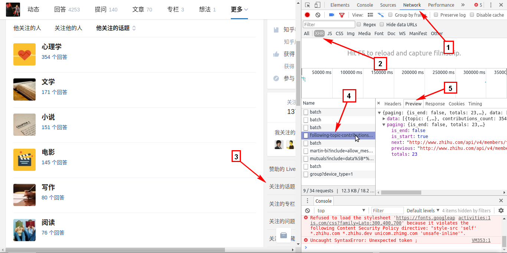

## 获取 API 的方法
1. 打开 Chrome 浏览器，打开 [https://www.zhihu.com/people/fu-er](https://www.zhihu.com/people/fu-er)。
1. 右键 - 检查  。
1. 查看 `Network` ， `XHR`。
1. 点击页面上"关注的话题"，右侧可看到网络解析的过程。
1. 点击右侧的 `following-topic-contributions.....` ，点击右侧 `Preview` ，即可看到返回的 json 数据。
1. 在 `following-topic-contributions.....` 上右键，点击 `Copy link address` ，得到获取 json 的 url 。
1. 在 [http://tool.chinaz.com/tools/urlencode.aspx](http://tool.chinaz.com/tools/urlencode.aspx) 上对该 url 解码，即可得到获取一个用户的 topic 数据的 API 。对以上用户来说， url 为[https://www.zhihu.com/api/v4/members/fu-er/following-topic-contributions?include=data[\*].topic.introduction&offset=20&limit=20](https://www.zhihu.com/api/v4/members/fu-er/following-topic-contributions?include=data[*].topic.introduction&offset=20&limit=20)。
1. 上面 url 中的`fu-er`即是要获取的用户 id，url 中的 offset 是从第几条数据开始，limit 指定从 offset 开始获取多少条数据。
1. 如此如法炮制，即可得到其他 API 。
1. 过程如图

## json 数据分析
对于以上`5`所获得的 json 数据，分析如下：
- `data`下的内容即是 json 的数据部分。
- `paging`下的内容，用来控制 json 的分页。
    - `is_end`标志着这是否是最后一页数据
    - `is_start`标志着这是否是第一页数据
    - `next`为下一页数据的 url
    - `previous`为上一页数据的 url
    - `totals`是数据的总条数
    
## 可用的 API
- 用户信息(profile)
    - `https://www.zhihu.com/api/v4/members/fu-er?include=locations,employments,gender,educations,business,voteup_count,thanked_Count,follower_count,following_count,cover_url,following_topic_count,following_question_count,following_favlists_count,following_columns_count,avatar_hue,answer_count,articles_count,pins_count,question_count,columns_count,commercial_question_count,favorite_count,favorited_count,logs_count,marked_answers_count,marked_answers_text,message_thread_token,account_status,is_active,is_bind_phone,is_force_renamed,is_bind_sina,is_privacy_protected,sina_weibo_url,sina_weibo_name,show_sina_weibo,is_blocking,is_blocked,is_following,is_followed,mutual_followees_count,vote_to_count,vote_from_count,thank_to_count,thank_from_count,thanked_count,description,hosted_live_count,participated_live_count,allow_message,industry_category,org_name,org_homepage,badge[?(type=best_answerer)].topics`
    - 能获取用户名、头像 url、从事行业、居住地址、获取赞同数、感谢数等
- 用户关注的用户(followee)
    - `https://www.zhihu.com/api/v4/members/fu-er/followees?include=data[*].answer_count,articles_count,gender,follower_count,is_followed,is_following,badge[?(type=best_answerer)].topics&offset=200&limit=200`

- 关注该用户的用户(follower)
    - `https://www.zhihu.com/api/v4/members/fu-er/followers?include=data[*].answer_count,articles_count,gender,follower_count,is_followed,is_following,badge[?(type=best_answerer)].topics&offset=0&limit=20`

- 关注的话题(topic)
    - `https://www.zhihu.com/api/v4/members/fu-er/following-topic-contributions?include=data[*].topic.introduction&offset=20&limit=20`

- 关注的问题(question)
    - `https://www.zhihu.com/api/v4/members/fu-er/following-questions?include=data[*].created,answer_count,follower_count,author&offset=0&limit=20`
- 用户的回答
    - `https://www.zhihu.com/api/v4/members/fu-er/answers?include=data[*].is_normal,admin_closed_comment,reward_info,is_collapsed,annotation_action,annotation_detail,collapse_reason,collapsed_by,suggest_edit,comment_count,can_comment,content,voteup_count,reshipment_settings,comment_permission,mark_infos,created_time,updated_time,review_info,question,excerpt,relationship.is_authorized,voting,is_author,is_thanked,is_nothelp,upvoted_followees;data[*].author.badge[?(type=best_answerer)].topics&offset=0&limit=20&sort_by=voteups`

- 用户的提问
    - `https://www.zhihu.com/api/v4/members/fu-er/questions?include=data[*].created,answer_count,follower_count,author,admin_closed_comment&offset=20&limit=20`

- 用户的文章
    - `https://www.zhihu.com/api/v4/members/fu-er/articles?include=data[*].comment_count,can_comment,comment_permission,admin_closed_comment,content,voteup_count,created,updated,upvoted_followees,voting,review_info;data[*].author.badge[?(type=best_answerer)].topics&offset=0&limit=20&sort_by=voteups`

- 用户关注的专栏
    - `https://www.zhihu.com/api/v4/members/fu-er/following-columns?include=data[*].intro,followers,articles_count&offset=20&limit=20`
